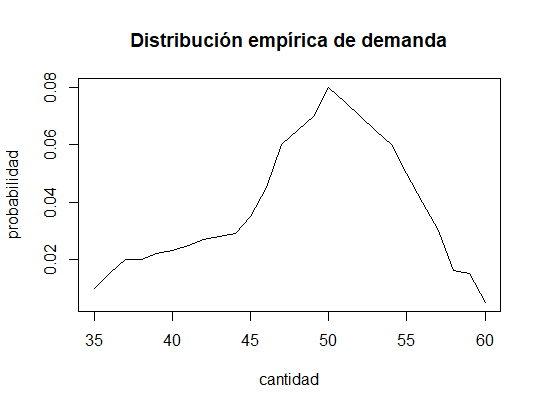
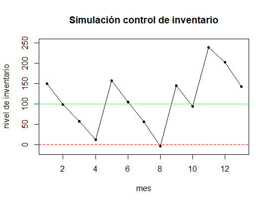

# Simulación de control de inventarios

Esta simulación emula el control de inventarios de un almacen. Aparece como ejemplo en el libro "Simulación un enfoque práctico" de Raul Coss Bu. (pág. 84). Suponga que la demanda promedio mensual de cierto producto obedece a la siguiente distribución de probabilidad empírica:

|Cantidad|Probabilidad|Cantidad|Probabilidad|Cantidad|Probabilidad|
|--------|------------|--------|------------|--------|------------|
|35|0.01|44|0.029|53|0.065|
|36|0.015|45|0.035|54|0.06|
|37|0.02|46|0.045|55|0.05|
|38|0.0.02|47|0.06|56|0.04|
|39|0.022|48|0.065|57|0.03|
|40|0.023|49|0.07|58|0.016|
|41|0.025|50|0.08|59|0.015|
|42|0.027|51|0.075|60|0.005|
|43|0.028|52|0.07|||

 Gráficamente, la distribución se muestra en la Figura 1.

||
|:--:|
|*Figura 1. Distribución empírica de la demanda*|

Para diferenciar la distribución por mes se consideran los siguientes factores de estacionalidad:

|Mes|1|2|3|4|5|6|7|8|9|10|11|12|
|--|--|--|--|--|-|-|-|-|-|-|-|-|
|Factor|1.2|1|0.9|0.8|0.8|0.7|0.8|0.9|1|1.2|1.3|1.4|

El costo por hacer una orden es de $100, el costo anual por unidad en inventario es de $20 y el costo de penalización por una unidad faltante es de $50. El inventario inicial es de 150 unidades.

Como ejemplo, supongamos que el nivel de reorden del almacen es de 100 unidades; es decir, cuando el nivel del inventario sea menor igual a este nivel, se debe hacer una orden. La cantidad de unidades que se ordena en este caso se asume de 200 unidades. La Figura 2 muestra gráficamente la simulación, la linea en verde representa el nivel de reorden. Comienza primero con un inventario de 150, la primer demanda promedio simulada es de 43 unidades; utilizando el factor de estacionalidad, la demanda es de `43(1.2)=51` unidades. Así, al final del mes el inventario será de `150-51=99`unidades; por lo tanto, se debe hacer una orden. El tiempo de entrega para ésta orden es de tres meses, por lo que en el mes cuatro hay un aumento de 200 unidades. Una orden se hace siempre y cuando el inventario esté por debajo del nivel de reorden y no haya una orden en curso, por eso no se ordenó en los meses dos y tres. Del mismo modo, la simulación transcurre hasta que en el mes seis se hace otra orden y de nuevo en el noveno mes, éstas con tiempo de entrega de dos y un meses, respectivamente. Note además que en el séptimo mes el inventario se encuentra en -3 unidades, por lo que se debe pagar penalización por tres unidaees faltantes. La siguiente tabla muestra a detalle los resultados de la simulación:

|Mes|Inventario|Demanda|Faltante|Orden|Costo|
|:--:|:-------:|:-----:|:------:|:---:|:---:|
|1|150|51||1|150(1.67)+100|
|2|99|42|||99*(1.67)|
|3|57|44|||57(1.67)|
|4|13|55|||13(1.67)|
|5|158|53|||158(1.67)|
|6|105|49|||105(1.67)|
|7|56|59||2|56(1.67)+100|
|8|0|52|3||3(50)|
|9|145|51|||145(1.67)|
|10|94|55||3|94(1.67)+100|
|11|239|37|||239(1.67)|
|12|202|59|||202(1.67)|
|||||**Total**|2646.05|

||
|:--:| 
| *Figura 2. Simulación del inventario durante un año* |

El costo anual de operación del almacen asciende a $2646.05.
