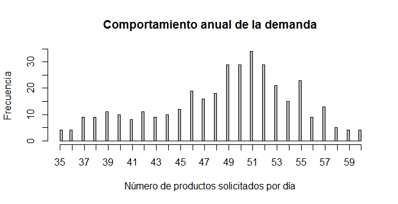

# Ejercicio 1: Control de inventarios
## Realizar la simulación del inventario de un almacen para disminuir pérdidas

Este ejercicio está basado en un ejemplo del libro: Simulación un enfoque práctico. Raul Coss Bu. *Editorial Limusa* (pág. 84).
Se desea representar el control de inventario de una empresa. 

Los datos históricos del volumen de ventas diario durante un año se encuentran el en archivo [demanda.csv](demanda.csv). La Figura 1 muestra el comportamiento de la demanda diaria.

|  | 
|:--:| 
| *Figura 1. Comportamiento de la demanda. Fuente: propia* |

El precio de venta del producto es de $160 por unidad. El costo diario por unidad en inventario es de $5. La empresa se compromete a siempre entregar el producto al cliente; si hace falta una unidad, la empresa la compra a un tercero a un costo de $200.

Cuando el nivel de inventario alcanza un nivel crítico, se hace una orden a la empresa pidiendo más productos. El tiempo que la empresa se demora en entregar la orden solicitada a almacen es variable. Durante el año se registraron 56 pedidos y  el registro de los tiempos de entrega se encuentra en el archivo [entregas.csv](entregas.csv).

El encargado del almacen hace un pedido de 150 unidades cuando el nivel de inventario baja de las 200 unidades, pero sus decisiones le están costando a la empresa el 45% de los insumos. Realice una simulación del control de inventarios y proporcione un tamaño de orden y nivel de reorden más adecuados para disminuir las pérdidas. Desarrolle un reporte escrito que incluya la situación actual, la propuesta de mejora y el impacto de ésta última.
